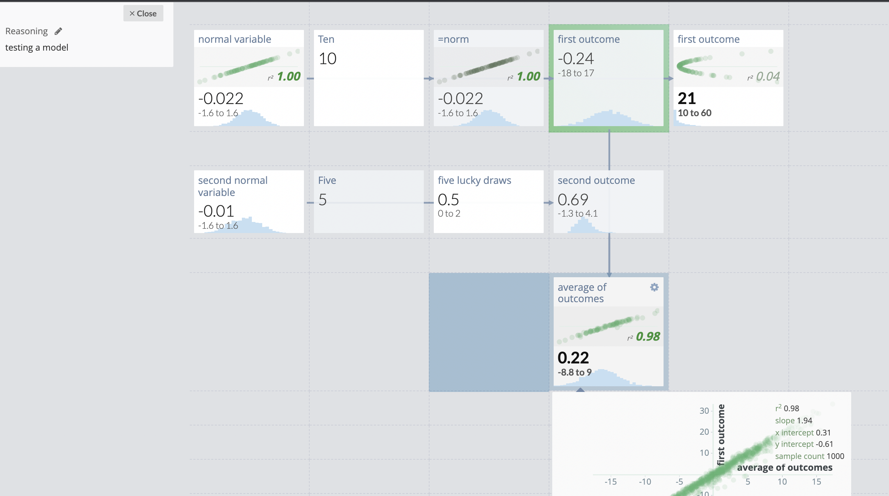

# Guesstimate

**Pros**

* Free and EA-aligned
* Graphical, interesting 'multiple flows' display
* Flexible, some good sensitivity analysis
* Clearly shows 'dependencies'
* Leaves out a lot of finance bells & whistles we don't need
* Connected (?) to some other tech or coding stuff (not sure), Ozzie Goien, Squiggle (?), "Slurp?"
* Nice documentation [here, in a gitbook](https://docs.getguesstimate.com)

**Cons**

* Not code-based
* No way to integrate with data (?)
* Not as well-maintained or user-friendly as Causal
* Object (box) labels hard to keep track of&#x20;
* No easy 'time series'&#x20;

****



Below, I just added a few boxes in two rows,&#x20;

* some stochastic (random draws, normal, etc)
* some determined (just numbers)
* some computing a formula as a function of the others
* then some 'sensitivity analysis' which I don't full understand&#x20;

And an expanded view of the above:\

 (1).png>)

